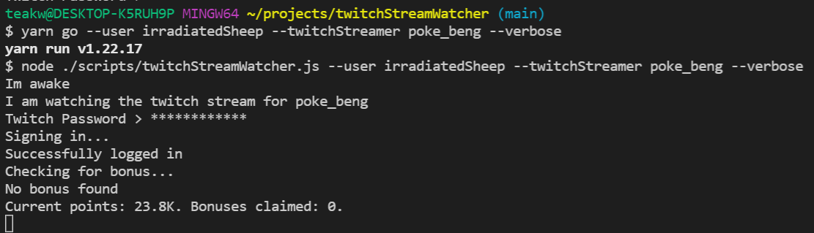

# Twitch Stream Watcher
A script to spin up a puppeteer controlled browser instance to watch a twitch stream and collect viewing points via being a passive watcher and by claiming bonuses as they appear.

## Usage 
`yarn go` - Actives the scripts. Arguments:
- `--user` or `-u` - Required - Username to log into twitch with
- `--twitchStreamer` or `-t` - Optional - User name of the twitch stream to watch - Default `poke_beng`
- `--verbose` or `-v` - Optional - Print extra output to console - Default `false`

## Example Usage
